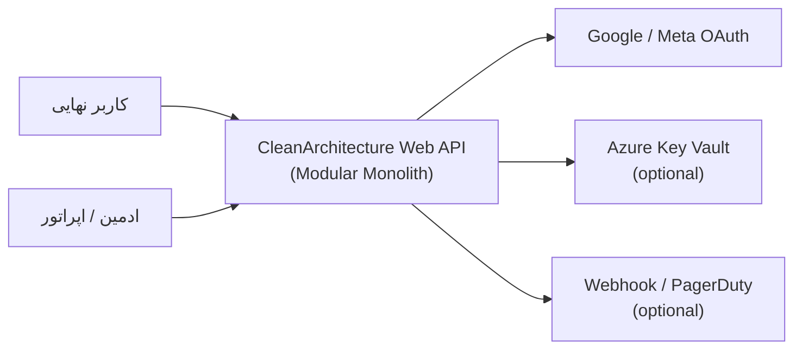
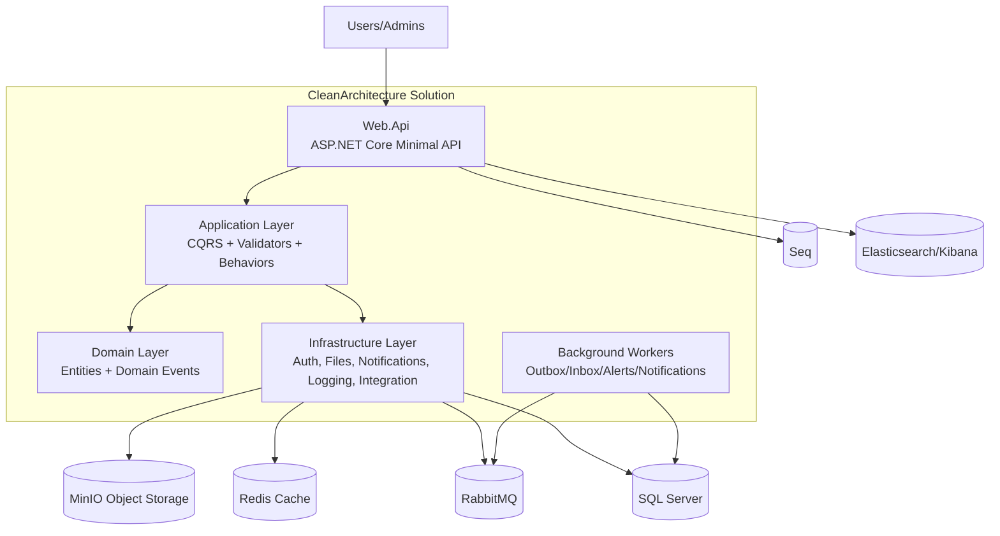
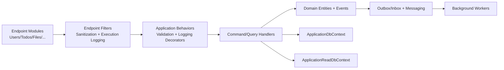

# C4 Model (نمای استاندارد سریع)

تاریخ: 2026-02-21  
مبنای تحلیل: commit `6db4c27`

## 1) C4 - سطح Context

### توضیح
- همه قابلیت های کسب وکاری در یک سیستم مرکزی ارائه می شوند.
- وابستگی های بیرونی به صورت optional/configurable هستند.

## 2) C4 - سطح Container

### نکات کلیدی
- پایگاه داده واحد است اما با schema-based modularization.
- کانال های async با Outbox/Inbox کنترل می شوند.
- مسیر logging هم داخلی (Logging module) و هم خارجی (Seq/ELK) پوشش داده شده است.

## 3) C4 - سطح Component (داخل Web API)

## 4) سناریوهای مرجع (برای درک سریع)

### سناریو A: ورود کاربر
1. `POST /api/v1/users/login`
2. اعتبارسنجی credential + lockout checks
3. صدور access token و refresh token
4. ذخیره hash توکن refresh در `auth.RefreshTokens`

### سناریو B: اشتراک امن فایل
1. `GET /api/v1/files/{id}/link` برای ساخت لینک signed
2. `GET /api/v1/files/public/{token}` برای دسترسی anonymous کنترل شده
3. rate limit ویژه + audit log برای public access

### سناریو C: رخداد لاگ تا اعلان هشدار
1. ingest لاگ در `/api/v1/logging/events`
2. بررسی ruleهای alert
3. ایجاد `AlertIncident`
4. queue شدن اعلان برای ادمین ها (Notification module)

### سناریو D: بازیابی شکست های orchestration
1. مشاهده سلامت در `/api/v1/dashboard/orchestration-health`
2. replay outbox/inbox با endpointهای observability

## 5) مرزهای مسئولیت (Boundaries)
- Endpointها فقط ورودی/خروجی HTTP و orchestration لایه بالا را انجام می دهند.
- منطق use case در Handlerها و Serviceهای تعریف شده در قرارداد Application قرار دارد.
- زیرساخت قابل تعویض است (Redis, RabbitMQ, MinIO, ClamAV, sinks).

## 6) نکته معماری مهم
تمام endpointهای ماژولی زیر `/api/v1/*` map می شوند.
