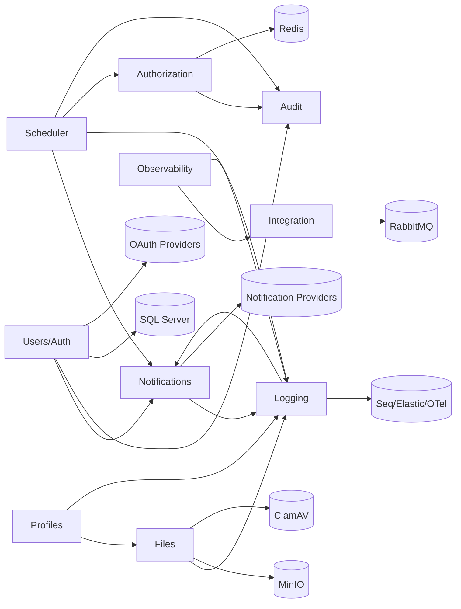

# نقشه Integration سیستم

تاریخ: 2026-02-21  
مبنای تحلیل: کد فعلی `src/*` و endpointهای `src/Web.Api/Endpoints/Modules/*`

## هدف
این سند نمای یکپارچه وابستگی ماژول‌ها، Integrationهای داخلی و سرویس‌های بیرونی را ارائه می‌دهد تا طراحی، توسعه و عملیات با دید end-to-end انجام شود.

## Integration داخلی (ماژول به ماژول)
| مبدا | مقصد | نوع ارتباط | هدف |
|---|---|---|---|
| Users/Auth | Notifications | همگام | ارسال کد تایید ایمیل/ریست رمز |
| Users/Auth | Audit | همگام | ثبت عملیات حساس امنیتی |
| Authorization | Audit | همگام | ثبت تغییر نقش/مجوز |
| Profiles | Files | همگام | اتصال avatar/music به فایل‌ها |
| Profiles | Logging | رویدادی | ثبت رخدادهای تغییر پروفایل |
| Files | Logging | همگام/رویدادی | ثبت audit لینک عمومی و دسترسی‌ها |
| Notifications | Logging | رویدادی | ثبت نتیجه ارسال اعلان |
| Logging | Notifications | ناهمگام | ارسال هشدار incident |
| Observability | Integration | همگام | replay inbox/outbox |
| Observability | Logging | همگام | نمایش KPI سلامت |
| Scheduler | Notifications | همگام | اجرای jobهای اعلان (probe) |
| Scheduler | Logging | همگام | ثبت اجرا، خطا، lag |
| Scheduler | Authorization | همگام | کنترل مجوزهای scheduler |
| Scheduler | Audit | همگام | ردگیری عملیات مدیریتی |

## Integration بیرونی
| سرویس | ماژول(ها) | کاربرد |
|---|---|---|
| SQL Server | همه | persistence داده ماژولی |
| Redis | Authorization, Caching | cache/versioning مجوزها |
| RabbitMQ | Integration, Notifications, Logging | پردازش ناهمگام پیام |
| MinIO/Object Storage | Files | نگهداری فایل |
| ClamAV (اختیاری) | Files | اسکن امنیتی فایل |
| SMTP/SMS/Slack/Teams/Push Providers | Notifications | ارسال چندکاناله |
| OAuth Providers (Google/Meta) | Users/Auth | ورود با حساب بیرونی |
| Seq/Elastic/OTel | Logging/Observability | پایش و تحلیل عملیاتی |

## نمودار کلان Integration

## الگوی استاندارد Integration برای ماژول جدید
1. قرارداد ماژول (Command/Query/Event) را در Application تعریف کنید.
2. persistence را در schema اختصاصی ماژول نگه دارید.
3. permission و policy endpointها را هم‌زمان با API تعریف کنید.
4. eventهای بین‌ماژولی را با Outbox منتشر کنید.
5. سنجه‌های سلامت (latency/error/retry) را در Observability قابل مشاهده کنید.
6. عملیات حساس را در Audit ثبت کنید.

## چک‌لیست بازبینی Integration
- مرز schema ماژول رعایت شده است.
- dependency مستقیم از Domain به Infrastructure وجود ندارد.
- مسیرهای API دارای permission مشخص هستند.
- خطاها و timeoutها retry policy مشخص دارند.
- برای عملیات بحرانی runbook عملیاتی وجود دارد.
