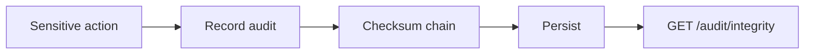

# ماژول Audit

تاریخ به‌روزرسانی: 2026-02-21

## هدف
ثبت و بررسی trail عملیات حساس به‌صورت tamper-evident.

## ترتیب IOrderedEndpoint
این ماژول از `IOrderedEndpoint` استفاده نمی‌کند.

## کاتالوگ کامل Endpointها
| Method | Path | دسترسی | دلیل وجود | ورودی‌ها |
|---|---|---|---|---|
| GET | `/api/v1/audit` | `audit.read` | جستجوی trail و تحلیل فعالیت‌ها | Query: `page/pageIndex`, `pageSize`, `actorId`, `action`, `from`, `to` |
| GET | `/api/v1/audit/integrity` | `audit.read` | بررسی صحت زنجیره checksum | Query: `updateFlags` |

## نکات طراحی مهم
- `audit/integrity` علاوه بر گزارش می‌تواند (با `updateFlags=true`) وضعیت رکوردها را update کند.
- این ماژول endpoint مدیریتی نوشتن مستقیم ندارد؛ نوشتن audit توسط سرویس‌های دیگر انجام می‌شود.

## وابستگی‌ها
- سایر ماژول‌ها (producer)
- schema `audit`

## سناریوهای خطا
- خرابی زنجیره hash
- mismatch ناشی از تغییرات غیرمجاز داده

## روند استفاده و Workflow
### مسیر اصلی
1. عملیات حساس در ماژول‌های مختلف رخ می‌دهد.
2. audit entry ایجاد می‌شود.
3. integrity report بررسی می‌شود.

### نمودار

