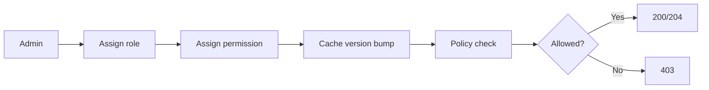

# ماژول Authorization

تاریخ به‌روزرسانی: 2026-02-21

## هدف
مدیریت RBAC و policyهای permission-based برای کل سیستم.

## ترتیب IOrderedEndpoint
این ماژول از `IOrderedEndpoint` استفاده نمی‌کند.

## کاتالوگ کامل Endpointها
| Method | Path | دسترسی | دلیل وجود | ورودی‌ها |
|---|---|---|---|---|
| GET | `/api/v1/authorization` | `authorization:manage` | دریافت ماتریس نقش/مجوز | ورودی ندارد |
| POST | `/api/v1/authorization/assign-role` | `authorization:manage` | تخصیص نقش به کاربر | Body: `userId`, `roleName` |
| POST | `/api/v1/authorization/assign-permission` | `authorization:manage` | تخصیص مجوز به نقش | Body: `roleName`, `permissionCode` |

## نکات طراحی مهم
- هر تغییر مهم در نقش/مجوز در Audit ثبت می‌شود.
- policyها به‌صورت permission code در endpointها enforce می‌شوند.
- cache مجوز باید بعد از تغییرات invalidate/version شود.

## مدل ورودی‌های مهم
- `AssignRoleToUser.Request`: `Guid UserId`, `string RoleName`
- `AssignPermissionToRole.Request`: `string RoleName`, `string PermissionCode`

## وابستگی‌ها
- Audit trail
- Permission cache/versioning (Redis/Memory)

## سناریوهای خطا
- نقش یا مجوز نامعتبر
- کاربر هدف وجود ندارد
- ناسازگاری موقت cache و دیتابیس

## روند استفاده و Workflow
### مسیر اصلی
1. `POST /authorization/assign-role`
2. `POST /authorization/assign-permission`
3. اعمال policy روی endpointهای هدف

### مسیر خطا
- role/permission نامعتبر
- cache stale

### نمودار

