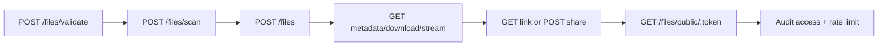
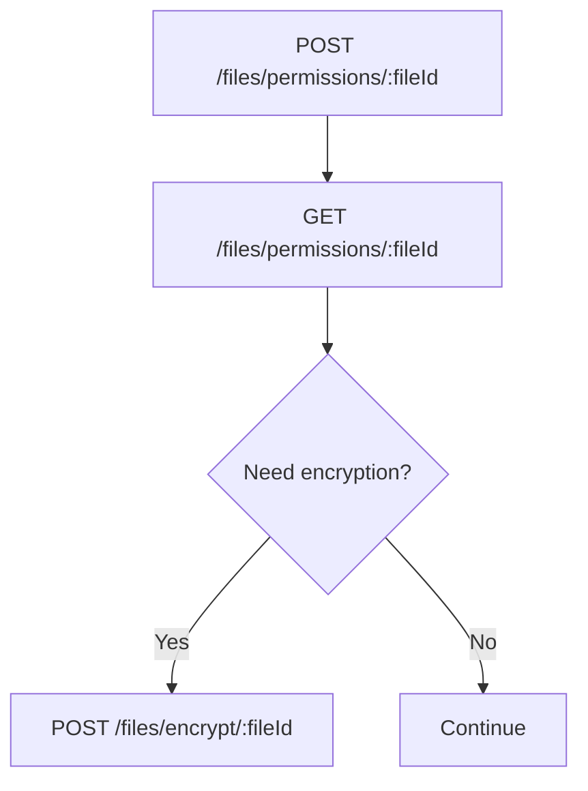

# ماژول Files

تاریخ به‌روزرسانی: 2026-02-21

## هدف
سرویس مدیریت فایل با قابلیت upload/download/stream، اشتراک امن، ACL و audit دسترسی.

## ترتیب IOrderedEndpoint
این ماژول از `IOrderedEndpoint` استفاده می‌کند. نکته: چند endpoint دارای Order یکسان هستند؛ ترتیب نهایی بین آن‌ها به ترتیب registration وابسته است.

| Order | Endpoint |
|---|---|
| 1 | `POST files` |
| 2 | `POST files/validate`, `GET files/{fileId}` |
| 3 | `POST files/scan`, `GET files/{fileId}/download` |
| 4 | `GET files/{fileId}/stream` |
| 5 | `GET files/{fileId}/link` |
| 6 | `POST files/{fileId}/share`, `GET files/audit/{fileId}` |
| 7 | `DELETE files/{fileId}`, `GET files/public/{token}` |
| 8 | `PUT files/{fileId}` |
| 9 | `PATCH files/{fileId}/move` |
| 10 | `GET files/search` |
| 11 | `GET files/filter` |
| 12 | `POST files/{fileId}/tags` |
| 13 | `GET files/tags/{tag}`, `POST files/permissions/{fileId}` |
| 14 | `GET files/permissions/{fileId}`, `POST files/encrypt/{fileId}` |
| 15 | `POST files/decrypt/{fileId}` |

## کاتالوگ کامل Endpointها
| Method | Path | دسترسی | دلیل وجود | ورودی‌ها |
|---|---|---|---|---|
| POST | `/api/v1/files` | `files.write` | آپلود فایل | Form: `file`, `module`, `folder`, `description` |
| POST | `/api/v1/files/validate` | `files.write` | اعتبارسنجی فایل قبل از upload کامل | Body: `fileName`, `sizeBytes`, `contentType` |
| POST | `/api/v1/files/scan` | `files.write` | اسکن امنیتی فایل | Form: `file`, `module`, `folder`, `description` |
| GET | `/api/v1/files/{fileId:guid}` | `files.read` | دریافت metadata فایل | Path: `fileId` |
| PUT | `/api/v1/files/{fileId:guid}` | `files.write` | بروزرسانی metadata | Path: `fileId`, Body: `fileName`, `description` |
| DELETE | `/api/v1/files/{fileId:guid}` | `files.delete` | حذف فایل | Path: `fileId` |
| GET | `/api/v1/files/{fileId:guid}/download` | `files.read` | دانلود فایل | Path: `fileId` |
| GET | `/api/v1/files/{fileId:guid}/stream` | `files.read` | stream فایل | Path: `fileId` |
| GET | `/api/v1/files/{fileId:guid}/link` | `files.share` | تولید لینک امن | Path: `fileId`, Query: `mode` |
| POST | `/api/v1/files/{fileId:guid}/share` | `files.share` | اشتراک‌گذاری فایل | Path: `fileId`, Query: `mode` |
| PATCH | `/api/v1/files/{fileId:guid}/move` | `files.write` | جابجایی فایل بین module/folder | Path: `fileId`, Body: `module`, `folder` |
| POST | `/api/v1/files/{fileId:guid}/tags` | `files.write` | افزودن tag | Path: `fileId`, Body: `tag` |
| GET | `/api/v1/files/tags/{tag}` | `files.read` | جستجو بر اساس tag | Path: `tag` |
| GET | `/api/v1/files/search` | `files.read` | جستجوی پیشرفته | Query: `query`, `fileType`, `uploaderId`, `from`, `to`, paging |
| GET | `/api/v1/files/filter` | `files.read` | فیلتر بر اساس module | Query: `module`, paging |
| GET | `/api/v1/files/audit/{fileId:guid}` | `files.read` | مشاهده trail دسترسی فایل | Path: `fileId` |
| POST | `/api/v1/files/permissions/{fileId:guid}` | `files.permissions.manage` | upsert مجوز فایل | Path: `fileId`, Body: `subjectType`, `subjectValue`, `canRead`, `canWrite`, `canDelete` |
| GET | `/api/v1/files/permissions/{fileId:guid}` | `files.permissions.manage` | دریافت ACL فایل | Path: `fileId` |
| POST | `/api/v1/files/encrypt/{fileId:guid}` | `files.permissions.manage` | علامت‌گذاری/اجرای encryption | Path: `fileId` |
| POST | `/api/v1/files/decrypt/{fileId:guid}` | `files.permissions.manage` | decrypt کنترل‌شده | Path: `fileId` |
| GET | `/api/v1/files/public/{token}` | عمومی/Contextual | دانلود/دسترسی از لینک عمومی | Path: `token` |

## نکات امنیتی و عملیاتی
- `Upload` و `Scan` با `DisableAntiforgery` و rate limit تنظیم شده‌اند.
- `files/public/{token}` policy rate-limit اختصاصی دارد.
- `GetSecureFileLink/Share` از `mode` برای کنترل رفتار لینک استفاده می‌کنند.
- برای محیط production، scan واقعی (ClamAV) و rotation کلید لینک ضروری است.

## مدل‌های ورودی مهم
- `UploadFileRequest`: file/form fields
- `ValidateFileRequest`: نام، حجم، نوع محتوا
- `ScanFileRequest`: ورودی مشابه upload
- `MoveFileRequest`: module/folder
- `UpdateFileMetadataRequest`: نام فایل/توضیح
- `UpsertFilePermissionRequest`: subject + سطح دسترسی

## وابستگی‌ها
- MinIO/ObjectStorage
- ClamAV (اختیاری)
- Audit trail داخلی فایل‌ها
- Logging برای لینک عمومی

## سناریوهای خطا
- token لینک عمومی نامعتبر یا منقضی
- upload فایل با content-type/size غیرمجاز
- ACL conflict در اشتراک‌گذاری

## روند استفاده و Workflow
### مسیر اصلی
1. validate + scan
2. upload
3. download/stream
4. secure/public link
5. ACL management

### Workflow (upload تا share)

### Workflow (ACL)

