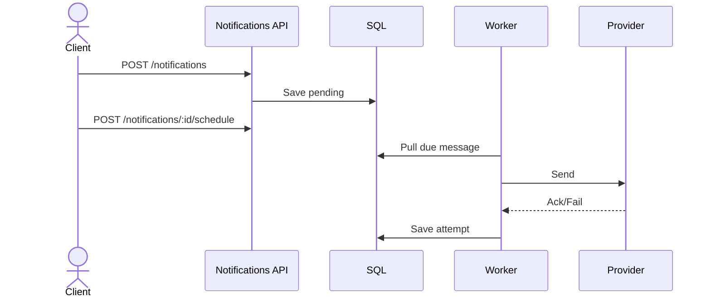

# ماژول Notifications

تاریخ به‌روزرسانی: 2026-02-21

## هدف
مدیریت اعلان چندکاناله شامل پیام، template، schedule، permission و گزارش.

## ترتیب IOrderedEndpoint
این ماژول از `IOrderedEndpoint` استفاده می‌کند. چند endpoint Order یکسان دارند.

| Order | Endpoint |
|---|---|
| 1 | `POST notifications` |
| 2 | `GET notifications/{notificationId}` |
| 3 | `GET notifications` |
| 4 | `POST notifications/templates` |
| 5 | `PUT notifications/templates/{templateId}` |
| 6 | `POST notifications/{notificationId}/schedule`, `GET notifications/schedules` |
| 7 | `DELETE notifications/archive/{id}`, `DELETE notifications/schedules/{scheduleId}`, `PUT notifications/{notificationId}/permissions`, `GET notifications/{notificationId}/permissions` |
| 8 | `GET notifications/reports/summary` |
| 9 | `GET notifications/reports/details` |
| 10 | `GET notification-templates/{templateId}` |
| 12 | `DELETE notification-templates/{templateId}` |
| 13 | `GET notification-templates` |

## کاتالوگ کامل Endpointها
| Method | Path | دسترسی | دلیل وجود | ورودی‌ها |
|---|---|---|---|---|
| POST | `/api/v1/notifications` | `notifications.write` | ایجاد اعلان جدید | Body: `channel`, `priority`, `recipient`, `subject`, `body`, `language`, `templateId`, `scheduledAtUtc` |
| GET | `/api/v1/notifications` | `notifications.read` | لیست اعلان‌ها | Query: paging + `channel`, `status`, `from`, `to` |
| GET | `/api/v1/notifications/{notificationId:guid}` | `notifications.read` | جزئیات اعلان | Path: `notificationId` |
| DELETE | `/api/v1/notifications/archive/{id:guid}` | `notifications.write` | آرشیو اعلان | Path: `id` |
| POST | `/api/v1/notifications/{notificationId:guid}/schedule` | `notifications.schedules.manage` | زمان‌بندی ارسال | Path: `notificationId`, Body: `runAtUtc`, `ruleName` |
| GET | `/api/v1/notifications/schedules` | `notifications.schedules.manage` | لیست scheduleها | - |
| DELETE | `/api/v1/notifications/schedules/{scheduleId:guid}` | `notifications.schedules.manage` | حذف schedule | Path: `scheduleId` |
| PUT | `/api/v1/notifications/{notificationId:guid}/permissions` | `notifications.permissions.manage` | upsert ACL اعلان | Path: `notificationId`, Body: `subjectType`, `subjectValue`, `canRead`, `canManage` |
| GET | `/api/v1/notifications/{notificationId:guid}/permissions` | `notifications.permissions.manage` | دریافت ACL اعلان | Path: `notificationId` |
| GET | `/api/v1/notifications/reports/summary` | `notifications.reports.read` | گزارش تجمیعی | Query: `from`, `to` |
| GET | `/api/v1/notifications/reports/details` | `notifications.reports.read` | گزارش جزئیات با فیلتر | Query: paging + `from`, `to`, `channel`, `status` |
| POST | `/api/v1/notifications/templates` | `notifications.templates.manage` | ایجاد template | Body: `name`, `channel`, `language`, `subjectTemplate`, `bodyTemplate` |
| PUT | `/api/v1/notifications/templates/{templateId:guid}` | `notifications.templates.manage` | بروزرسانی template | Path: `templateId`, Body: `subjectTemplate`, `bodyTemplate` |
| GET | `/api/v1/notification-templates` | `notifications.templates.manage` | لیست templateها | Query: `language`, `channel` |
| GET | `/api/v1/notification-templates/{templateId:guid}` | `notifications.templates.manage` | دریافت template | Path: `templateId` |
| DELETE | `/api/v1/notification-templates/{templateId:guid}` | `notifications.templates.manage` | حذف template | Path: `templateId` |

## نکات طراحی مهم
- template lifecycle جدا شده تا versioning و governance مستقل بماند.
- ACL اعلان مستقل از مجوزهای سراسری ماژول است.
- گزارش summary/details برای monitoring تحویل و SLA کاربرد دارد.

## مدل‌های ورودی مهم
- `CreateNotificationRequest`
- `ListNotificationsRequest`
- `ScheduleNotificationRequest`
- `UpsertNotificationPermissionRequest`
- `NotificationReportDetailsRequest`
- `CreateNotificationTemplateRequest`
- `UpdateNotificationTemplateRequest`

## وابستگی‌ها
- providerهای ارسال (Email/SMS/Push/...) 
- Logging برای ثبت outcome
- schema `notifications`

## سناریوهای خطا
- template نامعتبر یا channel ناسازگار
- schedule در زمان گذشته
- محدودیت provider یا credential failure

## روند استفاده و Workflow
### مسیر اصلی
1. `POST /notifications`
2. در صورت نیاز schedule
3. dispatch توسط worker
4. گزارش summary/details

### نمودار

