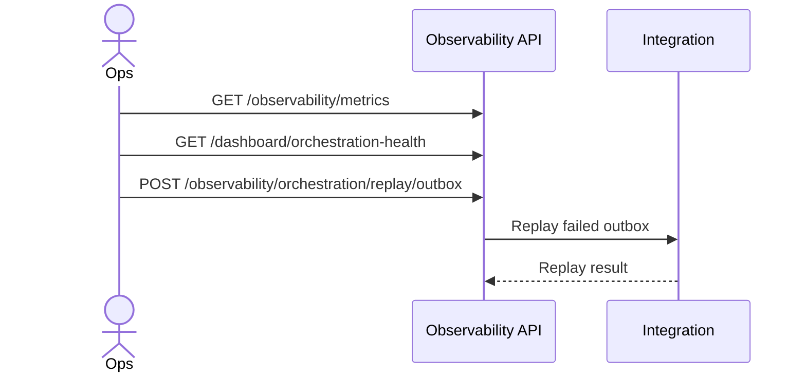

# ماژول Observability

تاریخ به‌روزرسانی: 2026-02-21

## هدف
مانیتورینگ سلامت عملیاتی و کنترل replay خطاهای orchestration.

## ترتیب IOrderedEndpoint
این ماژول از `IOrderedEndpoint` استفاده نمی‌کند.

## کاتالوگ کامل Endpointها
| Method | Path | دسترسی | دلیل وجود | ورودی‌ها |
|---|---|---|---|---|
| GET | `/api/v1/observability/metrics` | `observability.read` | snapshot KPIهای عملیاتی | - |
| GET | `/api/v1/dashboard/orchestration-health` | `observability.read` | وضعیت سلامت orchestration | - |
| GET | `/api/v1/observability/events/catalog` | `observability.read` | کاتالوگ event contractها | - |
| POST | `/api/v1/observability/orchestration/replay/outbox` | `observability.manage` | replay خطاهای outbox | Body: `take` (default: 100) |
| POST | `/api/v1/observability/orchestration/replay/inbox` | `observability.manage` | replay خطاهای inbox | Body: `take` (default: 100) |

## نکات طراحی مهم
- replayها action عملیاتی هستند و باید با SOP اجرا شوند.
- برای جلوگیری از فشار ناگهانی، `take` محدود و مرحله‌ای انتخاب شود.

## وابستگی‌ها
- Integration inbox/outbox
- Logging و Notifications برای شاخص‌های سلامت

## سناریوهای خطا
- replay با حجم زیاد و اثر جانبی تکراری
- هم‌زمانی replay با پردازش normal queue

## روند استفاده و Workflow
### مسیر اصلی
1. مشاهده metrics/health
2. تشخیص backlog
3. replay inbox/outbox

### نمودار

