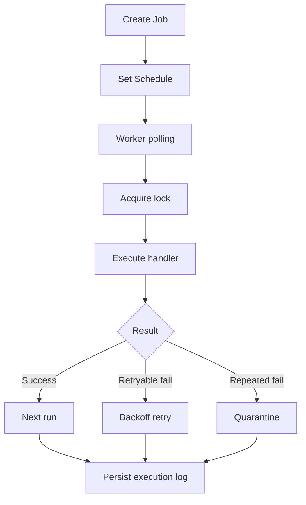

# ماژول Scheduler

تاریخ به‌روزرسانی: 2026-02-21

## هدف
زمان‌بندی و اجرای پایدار jobها با پشتیبانی از retry, misfire policy, dependency, quarantine و گزارش.

## ترتیب IOrderedEndpoint
این ماژول کاملا از `IOrderedEndpoint` استفاده می‌کند.

| Order | Method | Path |
|---|---|---|
| 1 | POST | `scheduler/jobs` |
| 2 | GET | `scheduler/jobs` |
| 3 | GET | `scheduler/jobs/{jobId}` |
| 4 | PUT | `scheduler/jobs/{jobId}` |
| 5 | DELETE | `scheduler/jobs/{jobId}` |
| 6 | POST | `scheduler/jobs/{jobId}/schedule` |
| 7 | GET | `scheduler/jobs/{jobId}/schedule` |
| 8 | DELETE | `scheduler/jobs/{jobId}/schedule` |
| 9 | POST | `scheduler/jobs/{jobId}/run` |
| 10 | POST | `scheduler/jobs/{jobId}/pause` |
| 11 | POST | `scheduler/jobs/{jobId}/resume` |
| 12 | POST/GET | `scheduler/jobs/{jobId}/replay` و `scheduler/jobs/{jobId}/logs` |
| 13 | POST/GET | `scheduler/jobs/{jobId}/quarantine` و `scheduler/jobs/logs` |
| 14 | GET | `scheduler/jobs/report` |
| 15 | GET | `scheduler/jobs/{jobId}/permissions` |
| 16 | PUT | `scheduler/jobs/{jobId}/permissions` |
| 17 | POST | `scheduler/jobs/{jobId}/dependencies` |
| 18 | GET | `scheduler/jobs/{jobId}/dependencies` |
| 19 | DELETE | `scheduler/jobs/{jobId}/dependencies/{dependsOnJobId}` |

## کاتالوگ کامل Endpointها
| Method | Path | دسترسی | دلیل وجود | ورودی‌ها |
|---|---|---|---|---|
| POST | `/api/v1/scheduler/jobs` | `scheduler.write` | ایجاد job | Body: `name`, `description`, `type`, `payloadJson`, `maxRetryAttempts`, `retryBackoffSeconds`, `maxExecutionSeconds`, `maxConsecutiveFailures` |
| GET | `/api/v1/scheduler/jobs` | `scheduler.read` | لیست jobها | Query: paging + `status`, `search` |
| GET | `/api/v1/scheduler/jobs/{jobId:guid}` | `scheduler.read` | دریافت job | Path: `jobId` |
| PUT | `/api/v1/scheduler/jobs/{jobId:guid}` | `scheduler.write` | بروزرسانی job | Path: `jobId`, Body مشابه create |
| DELETE | `/api/v1/scheduler/jobs/{jobId:guid}` | `scheduler.manage` | غیرفعال‌سازی job | Path: `jobId` |
| POST | `/api/v1/scheduler/jobs/{jobId:guid}/schedule` | `scheduler.write` | تعریف/بروزرسانی schedule | Path: `jobId`, Body: `type`, `cronExpression`, `intervalSeconds`, `oneTimeAtUtc`, `startAtUtc`, `endAtUtc`, `misfirePolicy`, `maxCatchUpRuns` |
| GET | `/api/v1/scheduler/jobs/{jobId:guid}/schedule` | `scheduler.read` | دریافت schedule | Path: `jobId` |
| DELETE | `/api/v1/scheduler/jobs/{jobId:guid}/schedule` | `scheduler.manage` | حذف schedule | Path: `jobId` |
| POST | `/api/v1/scheduler/jobs/{jobId:guid}/run` | `scheduler.execute` | اجرای فوری job | Path: `jobId` |
| POST | `/api/v1/scheduler/jobs/{jobId:guid}/pause` | `scheduler.manage` | pause job | Path: `jobId` |
| POST | `/api/v1/scheduler/jobs/{jobId:guid}/resume` | `scheduler.manage` | resume job | Path: `jobId` |
| POST | `/api/v1/scheduler/jobs/{jobId:guid}/replay` | `scheduler.manage` | replay dead-letter executions | Path: `jobId` |
| POST | `/api/v1/scheduler/jobs/{jobId:guid}/quarantine` | `scheduler.manage` | قرنطینه دستی job | Path: `jobId`, Body: `quarantineMinutes`, `reason` |
| GET | `/api/v1/scheduler/jobs/{jobId:guid}/logs` | `scheduler.read` | لاگ اجرای job | Path: `jobId`, Query: paging |
| GET | `/api/v1/scheduler/jobs/logs` | `scheduler.reports.read` | لاگ تجمیعی همه jobها | Query: paging + `jobId`, `status`, `from`, `to` |
| GET | `/api/v1/scheduler/jobs/report` | `scheduler.reports.read` | گزارش خروجی | Query: `format` |
| GET | `/api/v1/scheduler/jobs/{jobId:guid}/permissions` | `scheduler.permissions.manage` | ACL job | Path: `jobId` |
| PUT | `/api/v1/scheduler/jobs/{jobId:guid}/permissions` | `scheduler.permissions.manage` | upsert ACL job | Path: `jobId`, Body: `subjectType`, `subjectValue`, `canRead`, `canManage` |
| POST | `/api/v1/scheduler/jobs/{jobId:guid}/dependencies` | `scheduler.manage` | افزودن وابستگی | Path: `jobId`, Body: `dependsOnJobId` |
| GET | `/api/v1/scheduler/jobs/{jobId:guid}/dependencies` | `scheduler.read` | دریافت وابستگی‌ها | Path: `jobId` |
| DELETE | `/api/v1/scheduler/jobs/{jobId:guid}/dependencies/{dependsOnJobId:guid}` | `scheduler.manage` | حذف وابستگی | Path: `jobId`, `dependsOnJobId` |

## نکات طراحی مهم
- `SchedulerWorker` بر اساس polling + distributed lock jobهای due را اجرا می‌کند.
- retry/backoff با policy قابل تنظیم per job type اعمال می‌شود.
- در failure متوالی، job به quarantine می‌رود و schedule disable می‌شود.
- dependency check قبل از اجرا انجام می‌شود.

## تنظیمات مهم
- `SeedDefaults`
- `PollingIntervalSeconds`
- `MaxDueJobsPerIteration`
- `LockLeaseSeconds`
- `MisfireGraceSeconds`
- `DefaultQuarantineMinutes`
- `NodeId`

## وابستگی‌ها
- schema `scheduler`
- Notifications (مثل `NotificationDispatchProbeJobHandler`)
- Logging/Metrics
- Authorization/Audit

## سناریوهای خطا
- lock contention بین نودها
- misfire شدید در downtime طولانی
- dependency cycle یا dependency شکست‌خورده

## روند استفاده و Workflow
### مسیر اصلی
1. create/update job
2. set schedule
3. worker execution with distributed lock
4. retry/quarantine on failures
5. logs/reports/permissions/dependencies management

### نمودار

