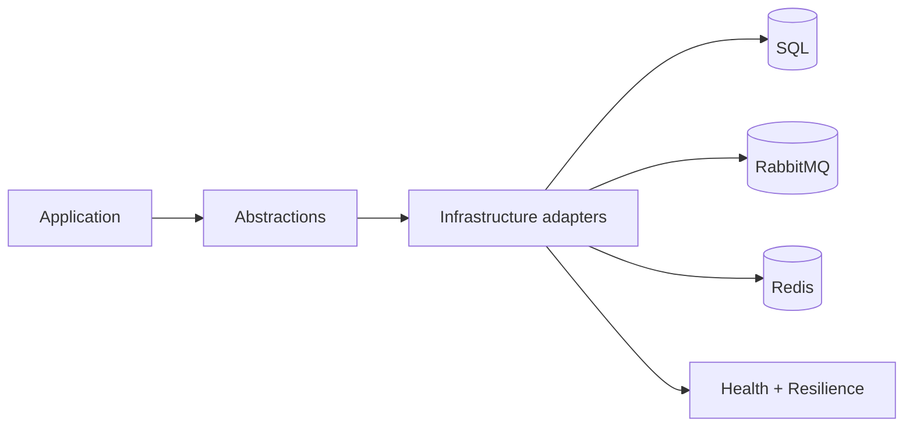

# پلتفرم مشترک (Cross-cutting)

تاریخ به‌روزرسانی: 2026-02-21

## هدف
فراهم‌کردن زیرساخت مشترک برای تمام ماژول‌ها: persistence، messaging، caching، resilience و health.

## ترتیب IOrderedEndpoint
این ماژول endpoint مستقل با `IOrderedEndpoint` ندارد.

## Endpointهای مرتبط پلتفرمی
| Method | Path | دسترسی | دلیل وجود | ورودی‌ها |
|---|---|---|---|---|
| GET | `/health` | عمومی | health سراسری سرویس | - |

## اجزای اصلی
- `Core`: time provider، dispatcher رویداد
- `DataAccess`: DbContext، migration، retry SQL
- `Caching`: Redis/Memory
- `Integration`: outbox/inbox + workers
- `HealthChecks`: readiness/liveness

## دلیل وجود
- حذف تکرار قابلیت‌های پایه در ماژول‌ها
- enforce الگوهای یکسان امنیت، resilience و logging
- ساده‌سازی عملیات و دیباگ cross-module

## نکات طراحی
- dependency مستقیم از Domain به Infrastructure ممنوع است.
- abstractionها در Application نگه داشته می‌شوند.
- health/retry باید برای همه adapterها یکنواخت اعمال شود.

## ریسک‌ها
- بزرگ‌شدن بیش از حد shared layer
- coupling ناخواسته اگر قراردادها واضح نگه داشته نشوند

## روند استفاده و Workflow
### مسیر اصلی
1. Application abstraction call
2. Infrastructure adapter execution
3. DB/Queue/Cache integration
4. health and resilience checks

### نمودار

