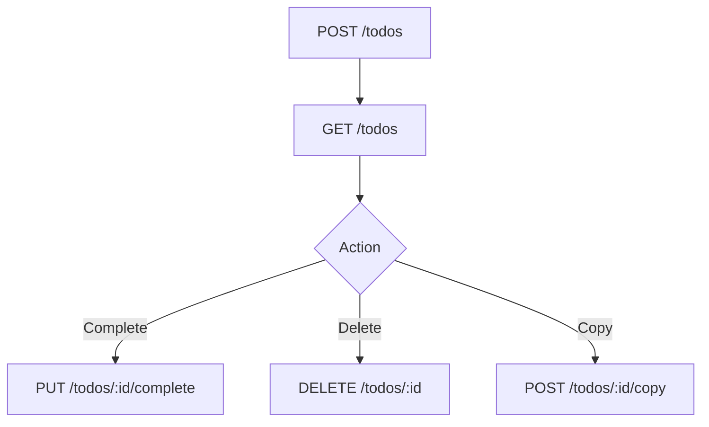

# ماژول Todos

تاریخ به‌روزرسانی: 2026-02-21

## هدف
مدیریت کارهای شخصی کاربر با CRUD و فیلتر.

## ترتیب IOrderedEndpoint
این ماژول از `IOrderedEndpoint` استفاده نمی‌کند.

## کاتالوگ کامل Endpointها
| Method | Path | دسترسی | دلیل وجود | ورودی‌ها |
|---|---|---|---|---|
| GET | `/api/v1/todos` | `todos:read` | لیست تسک‌های کاربر | Query: `page/pageIndex`, `pageSize`, `search`, `isCompleted`, `sortBy`, `sortOrder` |
| GET | `/api/v1/todos/{id:guid}` | `todos:read` | مشاهده تسک مشخص | Path: `id` |
| POST | `/api/v1/todos` | `todos:write` | ایجاد تسک جدید | Body: `description`, `dueDate`, `labels[]`, `priority` |
| PUT | `/api/v1/todos/{id:guid}/complete` | `todos:write` | تکمیل تسک | Path: `id` |
| DELETE | `/api/v1/todos/{id:guid}` | `todos:write` | حذف تسک | Path: `id` |
| POST | `/api/v1/todos/{todoId:guid}/copy` | `todos:write` | کپی تسک برای کاربر جاری | Path: `todoId` |

## نکات طراحی مهم
- لیست تسک‌ها paging نرمال‌شده دارد (Default/Max page size).
- owner context از `IUserContext` گرفته می‌شود.
- `copy` برای ایجاد duplicate سریع تسک طراحی شده است.

## مدل ورودی‌های مهم
- `GetTodosRequest`: جستجو، وضعیت تکمیل، paging/sort
- `Create.Request`: توضیح، ددلاین، برچسب‌ها، اولویت

## وابستگی‌ها
- UserContext
- EF Core (`todos` schema)

## سناریوهای خطا
- دسترسی به todo غیرمجاز
- payload نامعتبر در create
- id ناموجود در complete/delete/copy

## روند استفاده و Workflow
### مسیر اصلی
1. `POST /todos`
2. `GET /todos`
3. `PUT /todos/:id/complete` یا `DELETE /todos/:id`

### نمودار

