# روند استفاده و Workflow ماژول‌ها (نسخه عملیاتی پیشرفته)

تاریخ: 2026-02-21

## راهنمای خواندن سند
- این سند مکمل `docs/modules/*.md` است و روی «نحوه استفاده واقعی»، «مسیر خطا» و «رفتار عملیاتی» تمرکز دارد.
- برای هر ماژول، ابتدا مسیر happy path و بعد مسیر failure آورده شده است.
- دیاگرام‌ها با Mermaid هستند و برای مرور سریع تیم توسعه/عملیات طراحی شده‌اند.

---

## 1) Users/Auth
### بازیگران
- کاربر نهایی
- سرویس احراز هویت
- سرویس اعلان

### پیش‌نیازها
- تنظیم JWT و کلیدها
- فعال بودن provider اعلان برای verification/reset

### مسیر اصلی استفاده
1. کاربر `register` می‌کند.
2. سیستم کاربر را می‌سازد و کد تایید می‌فرستد.
3. کاربر ایمیل را verify می‌کند.
4. کاربر login می‌کند و access/refresh می‌گیرد.
5. در انقضا، refresh token برای تمدید استفاده می‌شود.

### مسیرهای خطا
- کد تایید منقضی -> درخواست resend verification
- refresh token مصرف‌شده/ابطال‌شده -> re-login
- lockout بعد از تلاش ناموفق متعدد -> تاخیر امنیتی + audit

### سیگنال‌های مانیتورینگ
- نرخ موفقیت `auth.login.success` در مقابل `auth.login.failed`
- تعداد revoke-all session
- زمان متوسط صدور token

### Workflow اصلی
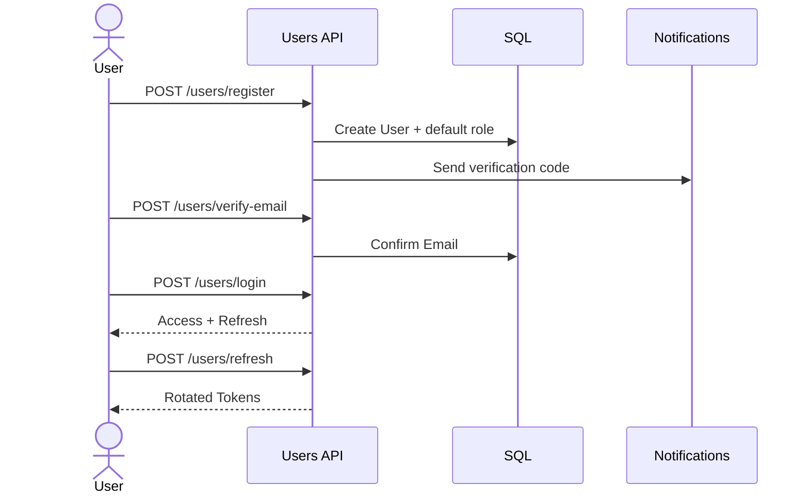

### چک‌لیست عملیات
- اگر نرخ login failure بالا رفت: lockout + IP pattern را بررسی کن.
- اگر verify-email شکست خورد: provider اعلان و queue delivery را بررسی کن.

---

## 2) Authorization
### بازیگران
- ادمین امنیت
- سرویس Authorization

### پیش‌نیازها
- نقش‌ها و permission codeها seed شده باشند.
- cache invalidation برای policy فعال باشد.

### مسیر اصلی استفاده
1. ادمین نقش را به user می‌دهد.
2. مجوز را به role می‌دهد.
3. کاربر در endpoint هدف policy check می‌شود.

### مسیرهای خطا
- role/permission نامعتبر
- cache stale و اختلاف با DB

### سیگنال‌های مانیتورینگ
- نرخ `403 Forbidden` به تفکیک endpoint
- تاخیر بازیابی ماتریس access-control

### Workflow
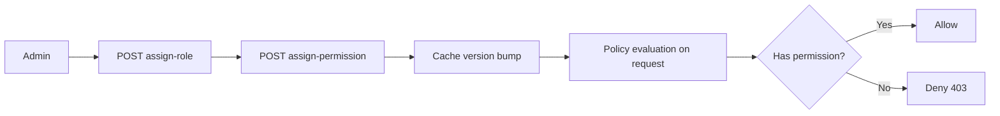

### چک‌لیست عملیات
- بعد از تغییر role/permission، cache version را verify کن.

---

## 3) Todos
### بازیگران
- کاربر نهایی

### پیش‌نیازها
- کاربر احرازشده با `todos.read` یا `todos.write`

### مسیر اصلی استفاده
1. ایجاد todo
2. مشاهده لیست با paging/filter
3. complete یا delete

### مسیرهای خطا
- id ناموجود
- دسترسی خارج از owner scope

### سیگنال‌های مانیتورینگ
- latency `GET /todos`
- error rate در `complete/delete`

### Workflow
```mermaid
flowchart TD
    A[POST /todos] --> B[GET /todos]
    B --> C{Action}
    C -->|Complete| D[PUT /todos/{id}/complete]
    C -->|Delete| E[DELETE /todos/{id}]
    C -->|Copy| F[POST /todos/{id}/copy]
```

### چک‌لیست عملیات
- page size بالا را محدود نگه دار تا فشار query زیاد نشود.

---

## 4) Profiles
### بازیگران
- کاربر نهایی
- ادمین گزارش

### پیش‌نیازها
- دسترسی `profiles.*`
- لینک معتبر به فایل avatar/music

### مسیر اصلی استفاده
1. ایجاد پروفایل
2. تکمیل gradual بخش‌ها (bio/contact/privacy/preferences/social)
3. تنظیم avatar/music
4. مشاهده public profile

### مسیرهای خطا
- فایل avatar نامعتبر
- policy privacy ناسازگار
- داده ناقص در گزارش ادمین

### سیگنال‌های مانیتورینگ
- completeness متوسط پروفایل
- نرخ update بخش‌های privacy

### Workflow
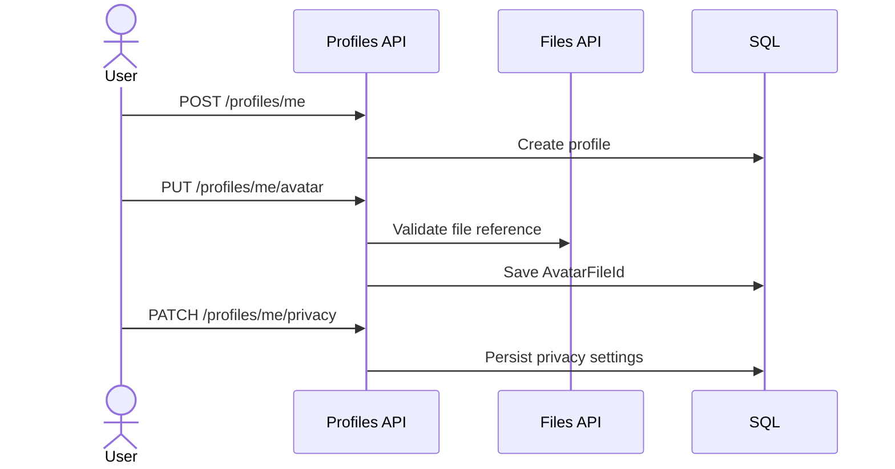

### چک‌لیست عملیات
- تغییرات privacy را در audit/analytics دوره‌ای مرور کن.

---

## 5) Files
### بازیگران
- کاربر داخلی
- گیرنده لینک عمومی
- سرویس امنیت/اسکن

### پیش‌نیازها
- object storage فعال
- policy validation/scan تنظیم شده

### مسیر اصلی استفاده
1. validate/scan فایل
2. upload و ذخیره metadata
3. download/stream
4. share با secure/public link
5. مدیریت ACL/permissions

### مسیرهای خطا
- scan fail (malware)
- token عمومی نامعتبر یا منقضی
- ACL conflict

### سیگنال‌های مانیتورینگ
- upload success/error rate
- public link access count
- scan failure ratio

### Workflow (upload تا share)
```mermaid
flowchart LR
    A[POST /files/validate] --> B[POST /files/scan]
    B --> C[POST /files]
    C --> D[GET metadata/download/stream]
    D --> E[GET link or POST share]
    E --> F[GET /files/public/{token}]
    F --> G[Audit access + rate limit]
```

### Workflow (ACL)
```mermaid
flowchart TD
    A[POST /files/permissions/{fileId}] --> B[GET /files/permissions/{fileId}]
    B --> C{Need encryption?}
    C -->|Yes| D[POST /files/encrypt/{fileId}]
    C -->|No| E[Continue]
```

### چک‌لیست عملیات
- کلید signing لینک عمومی را rotate کن.
- روی endpoint عمومی نرخ درخواست غیرعادی را alert کن.

---

## 6) Notifications
### بازیگران
- سرویس‌های تولیدکننده اعلان
- worker dispatch
- provider بیرونی

### پیش‌نیازها
- templateهای معتبر
- credential provider معتبر

### مسیر اصلی استفاده
1. ایجاد اعلان (مستقیم یا template-based)
2. schedule در صورت نیاز
3. dispatch توسط worker
4. ثبت attempt/result
5. گزارش summary/details

### مسیرهای خطا
- provider down/timeout
- template invalid
- schedule در گذشته

### سیگنال‌های مانیتورینگ
- delivery success rate per channel
- retry count distribution
- queue delay

### Workflow
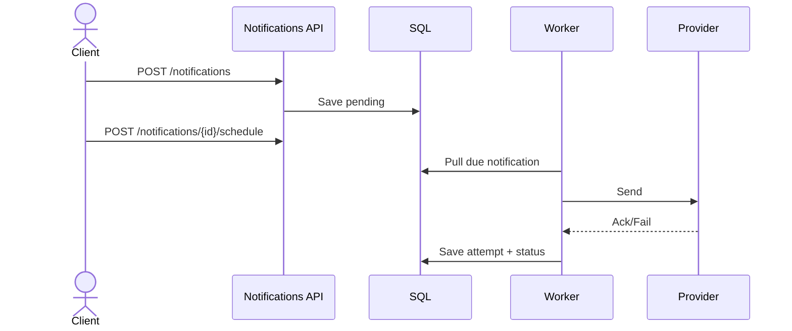

### Workflow (template lifecycle)
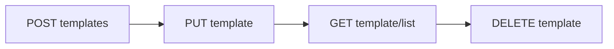

### چک‌لیست عملیات
- failure provider را با fallback channel مدیریت کن.
- در surge ارسال، throttle provider را فعال کن.

---

## 7) Logging
### بازیگران
- سرویس‌های تولیدکننده رخداد
- تیم عملیات و امنیت

### پیش‌نیازها
- schema و ruleها تعریف شده باشند.
- Idempotency-Key در client ingest ارسال شود.

### مسیر اصلی استفاده
1. ingest (single/bulk)
2. validate/transform
3. ذخیره رخداد
4. match rule و تولید incident
5. مشاهده incident و اعمال action

### مسیرهای خطا
- payload ناقص/ناسازگار
- رشد ناگهانی حجم ingest
- alert noise بر اثر rule اشتباه

### سیگنال‌های مانیتورینگ
- ingest throughput
- corrupted events count
- incident creation rate
- logging health status

### Workflow
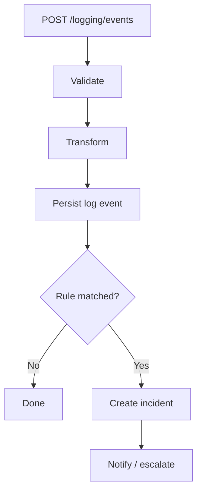

### Workflow (access-control)
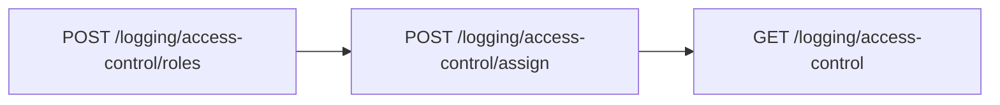

### چک‌لیست عملیات
- ruleهای جدید را ابتدا روی محیط staging تست کن.
- alertهای تکراری را با threshold و window تنظیم کن.

---

## 8) Audit
### بازیگران
- همه ماژول‌های producer
- تیم امنیت

### پیش‌نیازها
- ثبت audit برای عملیات حساس فعال باشد.

### مسیر اصلی استفاده
1. عملیات حساس انجام می‌شود.
2. audit entry با checksum chain ثبت می‌شود.
3. integrity report دوره‌ای بررسی می‌شود.

### مسیرهای خطا
- شکست integrity report
- قطع ثبت audit در ماژول producer

### سیگنال‌های مانیتورینگ
- تعداد رویداد audit در بازه زمانی
- integrity failure count

### Workflow
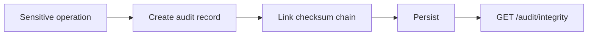

### چک‌لیست عملیات
- integrity report را در بازه‌های ثابت (مثلا روزانه) اجرا کن.

---

## 9) Observability
### بازیگران
- تیم عملیات (SRE/DevOps)

### پیش‌نیازها
- متریک‌ها و health endpoints در dashboard متصل باشند.

### مسیر اصلی استفاده
1. مشاهده metrics و orchestration health
2. تشخیص failure backlog
3. replay inbox/outbox با batch کنترل‌شده

### مسیرهای خطا
- replay بیش از حد و اثرات تکراری
- تحلیل اشتباه health snapshot

### سیگنال‌های مانیتورینگ
- failed outbox/inbox count
- replay success ratio
- health degradation trend

### Workflow
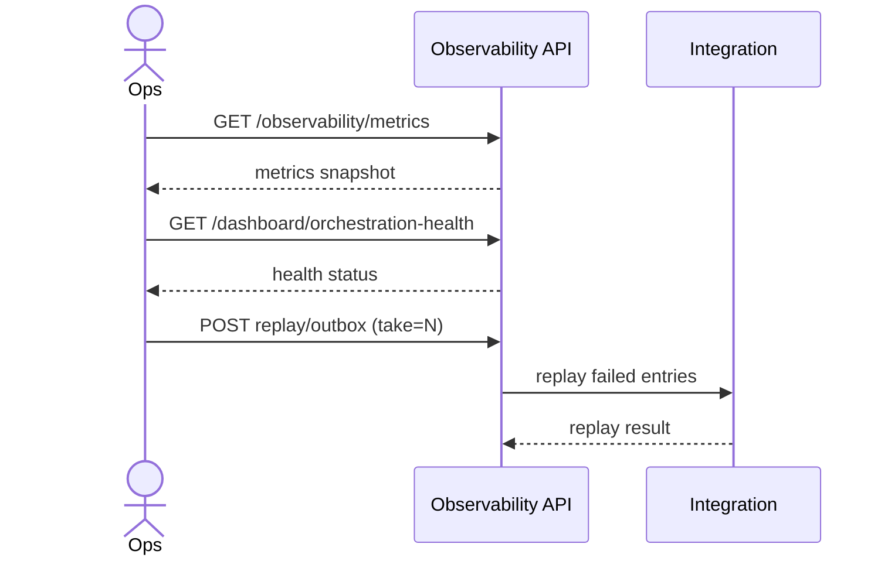

### چک‌لیست عملیات
- replay را در batchهای کوچک و با مانیتور اثر جانبی اجرا کن.

---

## 10) Scheduler
### بازیگران
- ادمین عملیات
- Scheduler worker
- Job handlers

### پیش‌نیازها
- تعریف job و schedule معتبر
- lock provider و worker فعال

### مسیر اصلی استفاده
1. تعریف job
2. تعریف schedule
3. worker jobهای due را شناسایی می‌کند
4. lock می‌گیرد و handler اجرا می‌کند
5. نتیجه ثبت می‌شود و next run محاسبه می‌گردد

### مسیرهای خطا
- dependency unsatisfied
- timeout/cancel/fail
- retry exhausted -> dead-letter/quarantine

### سیگنال‌های مانیتورینگ
- queue lag (ms)
- execution duration
- retry attempts
- quarantine count

### Workflow اصلی
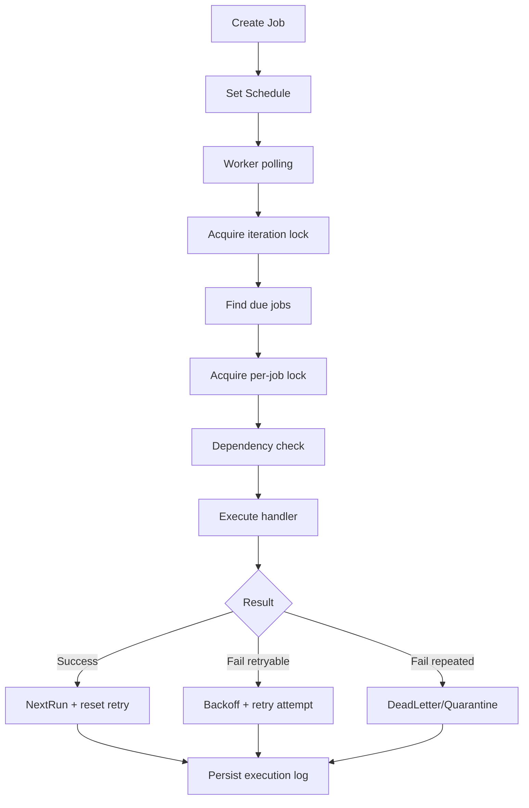

### Workflow کنترل دستی
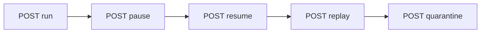

### چک‌لیست عملیات
- اگر lag بالا رفت: `MaxDueJobsPerIteration` و polling را tune کن.
- اگر lock contention بالا رفت: lease و node distribution را بررسی کن.
- اگر quarantine زیاد شد: payload validator و handler stability را بررسی کن.

---

## 11) Shared Platform
### بازیگران
- همه ماژول‌های سیستم
- تیم عملیات زیرساخت

### پیش‌نیازها
- SQL/Redis/RabbitMQ/HealthChecks فعال

### مسیر اصلی استفاده
1. ماژول Application فقط abstraction را فراخوانی می‌کند.
2. Infrastructure implementation تزریق می‌شود.
3. resilience (retry/timeout) و health centrally اعمال می‌شود.

### مسیرهای خطا
- قطع dependency زیرساختی
- misconfiguration در connection/policy

### سیگنال‌های مانیتورینگ
- health overall
- retry rate روی DB/MQ
- queue depth

### Workflow
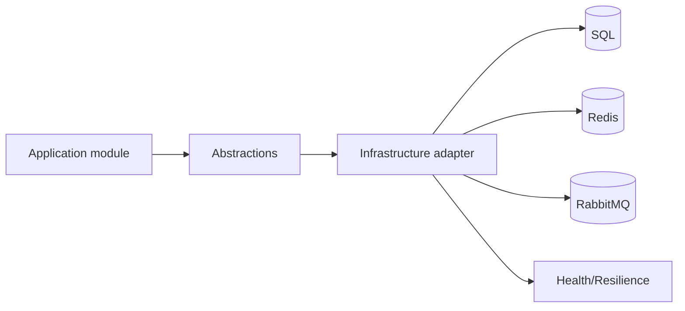

### چک‌لیست عملیات
- health endpoint `/health` را به alerting وصل کن.
- connection pool و retry policy را متناسب با بار تنظیم کن.

---

## ماتریس سریع تصمیم عملیاتی
| وضعیت | ماژول | اقدام فوری |
|---|---|---|
| افزایش خطای ورود | Users/Auth | بررسی lockout، provider اعلان، audit login |
| موج 403 | Authorization | بررسی assignment جدید و cache version |
| رشد تاخیر دانلود فایل | Files | بررسی object storage + rate limits |
| افت نرخ تحویل اعلان | Notifications | بررسی provider credentials + retry queue |
| رشد incidentها | Logging | بررسی ruleها و noisy alerts |
| شکست integrity | Audit | اجرای گزارش integrity و بررسی tamper flags |
| backlog orchestration | Observability/Integration | replay batch با `take` کنترل‌شده |
| رشد quarantine job | Scheduler | بررسی handler، payload، retry policy |
