# روند استفاده و Workflow ماژول‌ها

تاریخ: 2026-02-21

## 1) Users/Auth
### Integrationها
- Notification برای OTP/Verification
- Audit برای رخدادهای امنیتی

### روند استفاده
1. کاربر `register` می‌کند.
2. کد تایید ایمیل ارسال می‌شود.
3. کاربر تایید ایمیل انجام می‌دهد.
4. کاربر `login` می‌کند و access/refresh می‌گیرد.
5. در انقضا، `refresh` انجام می‌شود.

### Workflow
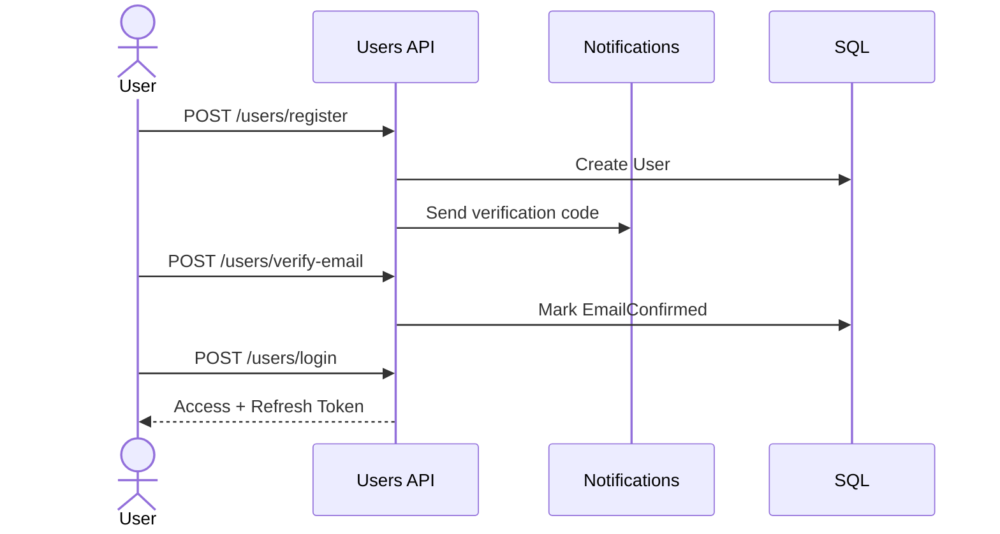

## 2) Authorization
### Integrationها
- Caching (Redis/Memory) برای versioning permission
- Audit برای ثبت تغییرات کنترل دسترسی

### روند استفاده
1. ادمین نقش را به کاربر اختصاص می‌دهد.
2. ادمین مجوز را به نقش اختصاص می‌دهد.
3. APIها با policy پویا مجوز را enforce می‌کنند.

### Workflow
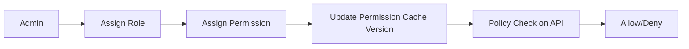

## 3) Todos
### Integrationها
- وابستگی مستقیم به user context

### روند استفاده
1. کاربر todo ایجاد می‌کند.
2. لیست todo را با paging می‌بیند.
3. مورد را complete یا delete می‌کند.

### Workflow
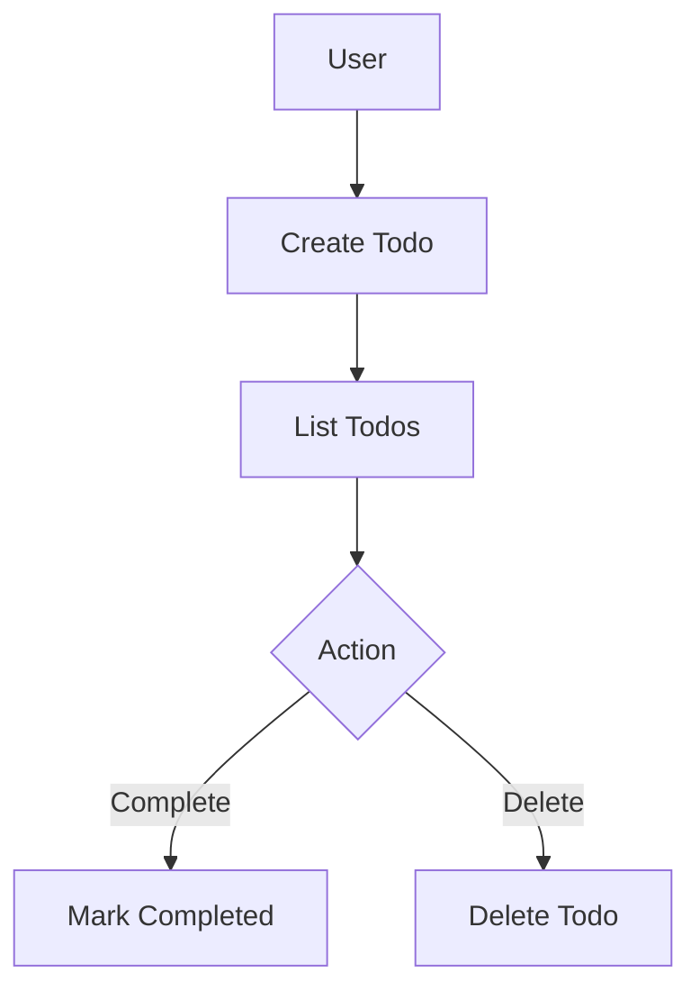

## 4) Profiles
### Integrationها
- Files برای avatar/music
- Logging/Notifications برای رویداد تغییرات مهم

### روند استفاده
1. کاربر پروفایل خود را می‌سازد.
2. بخش‌های مختلف را patch می‌کند.
3. public profile برای نمایش عمومی خوانده می‌شود.

### Workflow
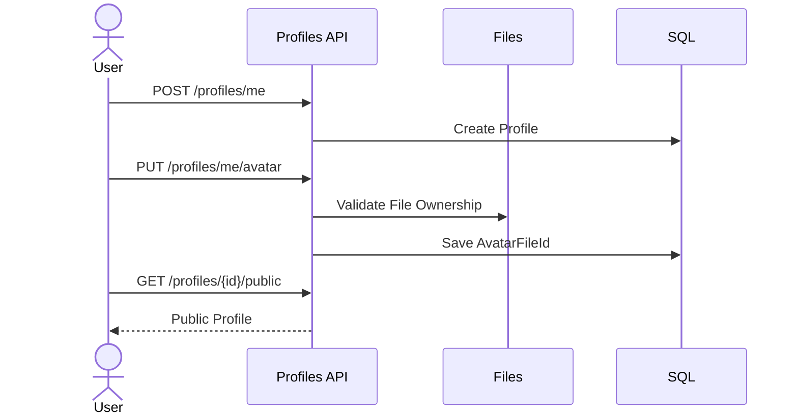

## 5) Files
### Integrationها
- MinIO برای object storage
- ClamAV (اختیاری) برای scan
- Logging برای audit دسترسی عمومی

### روند استفاده
1. کاربر فایل upload می‌کند.
2. validate/scan انجام می‌شود.
3. metadata ثبت و فایل قابل دانلود/stream می‌شود.
4. برای اشتراک، secure/public link تولید می‌شود.

### Workflow
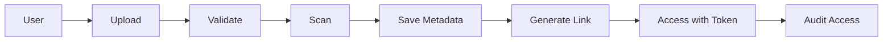

## 6) Notifications
### Integrationها
- Providerهای بیرونی ارسال
- Logging برای ثبت نتیجه ارسال

### روند استفاده
1. اعلان با template یا payload خام ساخته می‌شود.
2. در صورت نیاز schedule ثبت می‌شود.
3. worker اعلان را dispatch می‌کند.
4. نتیجه در attempts ذخیره می‌شود.

### Workflow
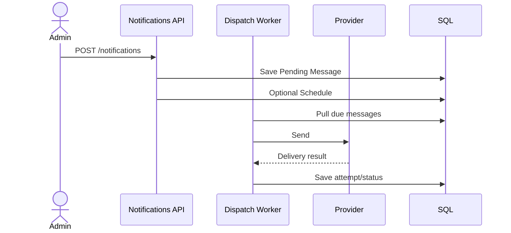

## 7) Logging
### Integrationها
- مصرف‌کننده رخداد از ماژول‌های مختلف
- اتصال به Notifications برای incident alert

### روند استفاده
1. رخداد single/bulk ingest می‌شود.
2. validate/transform انجام می‌شود.
3. ruleها incident تولید می‌کنند.
4. incident قابل query و پیگیری است.

### Workflow
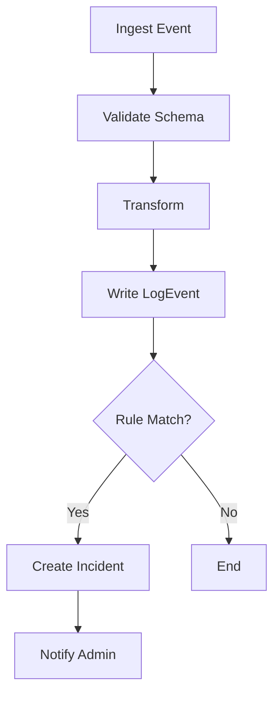

## 8) Audit
### Integrationها
- دریافت عملیات حساس از ماژول‌های مختلف

### روند استفاده
1. عملیات حساس ثبت می‌شود.
2. checksum chain کامل می‌شود.
3. گزارش integrity به‌صورت دوره‌ای بررسی می‌شود.

### Workflow
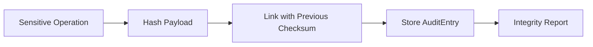

## 9) Observability
### Integrationها
- Integration (outbox/inbox)
- Logging و Notifications برای KPI

### روند استفاده
1. تیم عملیات متریک‌ها و health را مانیتور می‌کند.
2. خطاهای inbox/outbox را replay می‌کند.
3. نتیجه replay را ارزیابی می‌کند.

### Workflow
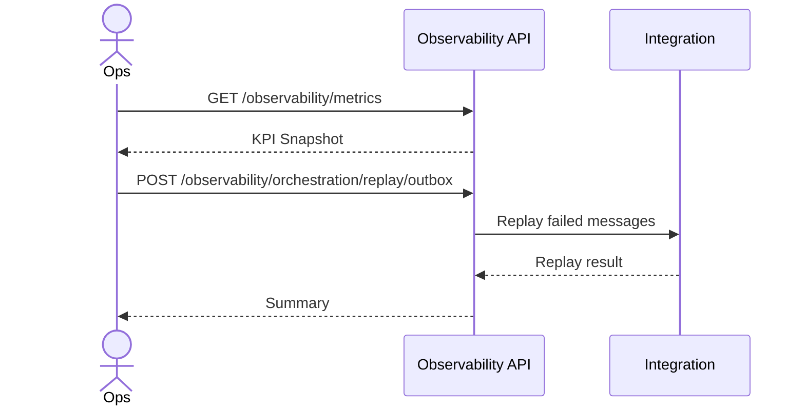

## 10) Scheduler
### Integrationها
- Notifications (jobهای اعلان)
- Logging/Metrics برای پایش اجرا
- Authorization/Audit برای کنترل و ردیابی

### روند استفاده
1. Job ایجاد می‌شود.
2. Schedule تعریف می‌شود.
3. Worker due job را پیدا می‌کند.
4. lock گرفته می‌شود و handler اجرا می‌شود.
5. نتیجه اجرا/Retry/Quarantine ثبت می‌شود.

### Workflow
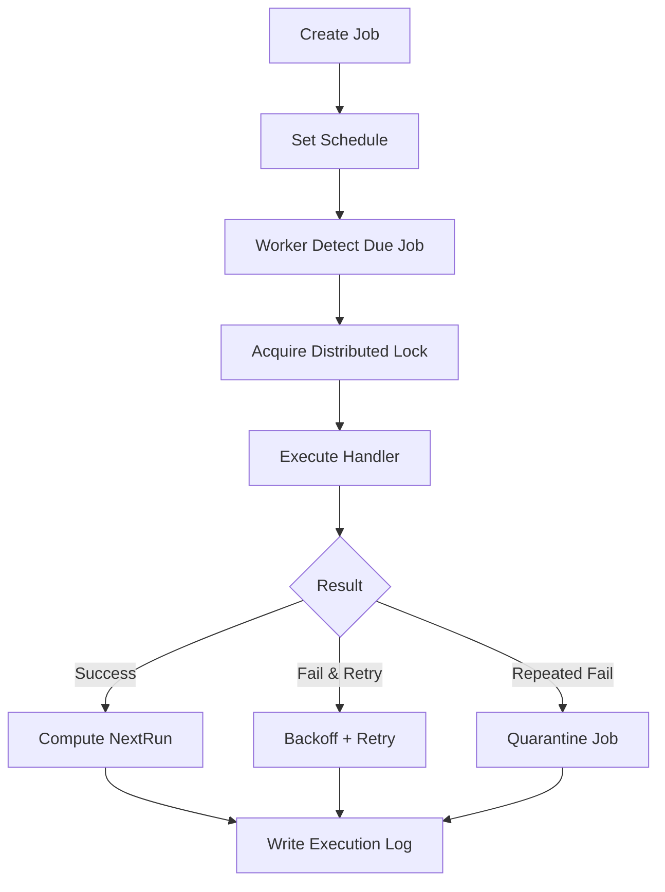

## 11) Shared Platform
### Integrationها
- DataAccess/Caching/Integration/HealthChecks برای همه ماژول‌ها

### روند استفاده
1. هر ماژول از abstractionهای Application استفاده می‌کند.
2. پیاده‌سازی‌های Infrastructure تزریق می‌شوند.
3. health و retry به‌صورت مرکزی اعمال می‌شود.

### Workflow
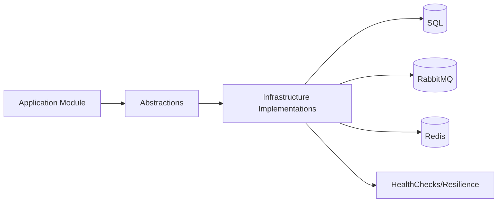
